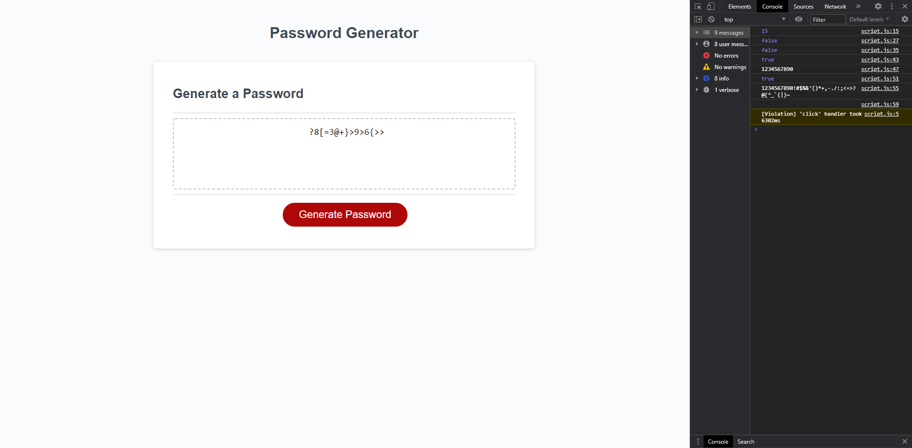

# Homework3
## Password-Generator

* Built a password generator that prompts the user for their own choices for the random password

* Choices include:

  * Numbers
  * Special characters
  * Uppercase letters
  * Lowercase letters

* Allows you to generate multiple passwords without having to refresh the site.

* Password length is limited to 8 - 128 characters.

# Picture of the website.

